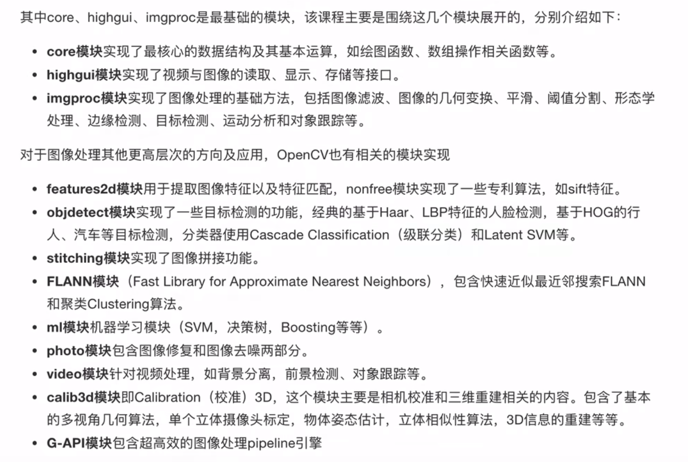

# baseOpenCV
## main core purpose
- It mainly consists of the architecture of OpenCV、IO operations using OpenCV、image processing methods、feature extraction and description methods and face recognition project.
- The url of the related video presentation: https://www.bilibili.com/video/BV1Fo4y1d7JL?p=1&vd_source=b6763bca1e70e8b7ca1770e409d21089
## core model in OpenCV

### 01 IO operation
1. 图像输入 cv.imread
2. 图像显示 cv.imshow plt.imshow
3. 图像保存 cv.imwrite

### 02 draw shape
1. 创造图像 np.zeros((512, 512, 3), uint8)
2. 绘制直线 cv.line
3. 绘制圆形 cv.circle
4. 绘制方形 cv.rectangle
5. 写字 cv.putText

### 03 single pixel operation
1. 查看像素点 image[x, y]
2. 查看某通道的像素点 image[x, y, 0]
3. 图像尺寸 image.shape
4. 图像像素点个数 image.size
5. 图像像素点数据类型 image.dtype

### 04 channel and color change
1. 通道拆分 cv.split
2. 通道合并 cv.merge
3. BGR->Gray cv.cvtColor(img, cv.COLOR_BGR2GRAY) 
4. BGR->HSV cv.cvtColor(img, cv.COLOR_BGR2HSV) 

### 05 basic image operation
1. 图像相加（cv相加） cv.add: 包和操作，效果更好
2. 图像相加（numpy相加）image1 + image2: 取模操作
3. 图像混合 cv.addWeighted

### 06 geometric Transformation
1. 图像缩放 cv.resize
2. 图像平移 cv.warpAffine
3. 图像旋转 cv.getRotationMatrix2D + cv.warpAffine
4. 仿射变换 cv.getAffineTransform + cv.warpAffine
5. 透射变换 cv.getPerspectiveTransform + cv.warpPerspective
6. 图像金字塔(多尺度) cv.pyrUp + cv.pyrDown

### 07 morphological operation
1. 连通关系 4连通、D连通、 8连通
2. 腐蚀：求局部最大值 cv.erode
3. 膨胀：求最不最小值 cv.dilate
4. 开运算：先腐蚀后膨胀 cv.morphologyEx(image, cv.MORPH_OPEN, kernel)
5. 闭运算：先膨胀后腐蚀 cv.morphologyEx(image, cv.MORPH_CLOSE, kernel)
6. 礼帽：原图像与开运算之差 cv.morphologyEx(image, cv.MORPH_TOPHAT, kernel)
7. 黑帽：闭运算与原图像之差 cv.morphologyEx(image, cv.MORPH_BLACKHAT, kernel)

### 08 image smoothing
1. 噪声：椒盐噪声（黑白点）、高斯噪声（各种灰度点）
2. 滤波：均值滤波、高斯滤波、中值滤波、双边滤波
3. 均值滤波 cv.blur
4. 高斯滤波 cv.GaussianBlur
5. 中值滤波 cv.medianBlur

### 09 histogram process
1. 灰度直方图：bins\dims\range cv.calcHist
2. 掩膜：感兴趣区域提取、结构提取
3. 直方图均衡化：提高背景对比度 cv.equalizeHist
4. 自适应均衡化：cv.createCLAHE

### 10 edge detection
1. 边缘检测：基于搜索、基于零穿越
2. Sobel算子：cv.Sobel+cv.convertScaleAbs+cv.addWeights
3. Schaar算子：cv.Sobel(ksize=-1)+cv.convertScaleAbs+cv.addWeights
4. Laplacian算子：cv.Laplacian+cv.convertScaleAbs
5. Canny算法：高斯滤波+计算图梯度+非极大值抑制+滞后阈值 cv.Canny

### 11 template match and Hough detection
1. 模板匹配：cv.matchTemplate